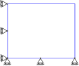
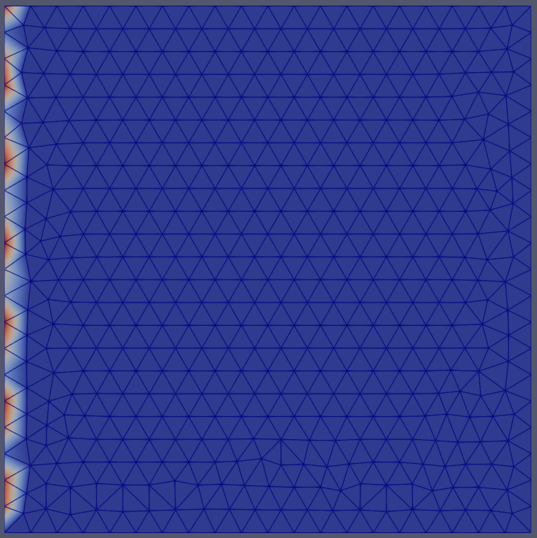
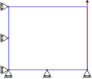
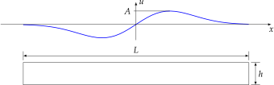
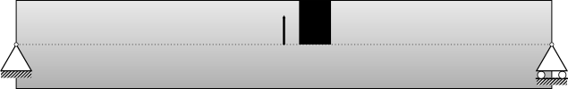
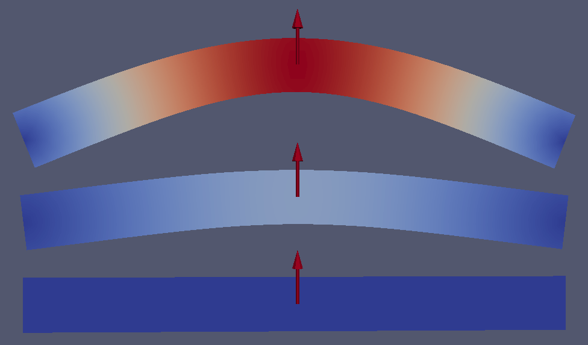
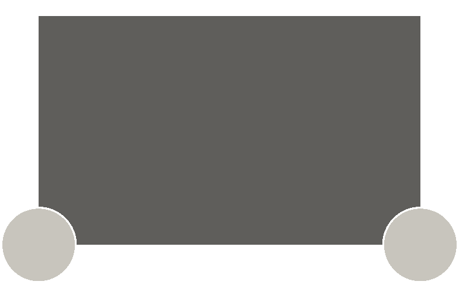
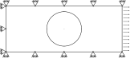

.. include:: auto_examples/index.rst


Tutorials
=========

Examples
=========

In addition to the tutorials, other C++ and Python examples are available in the ``examples`` folder. 

C++ examples
---------------------

Solid Mechanics Model
`````````````````````

Solid mechanics model examples are available in the ``solid_mechanics_model`` folder.

boundary_conditions
'''''''''''''''''''

In ``predifined_bc`` it is shown how to impose Dirichlet boundary condition using the predefined ``BC::Dirichlet::FixedValue`` (:numref:`fig-ex-predefined_bc`). Three built-in Dirichlet functors exist: ``FixedValue``, ``FlagOnly`` and ``IncrementValue``.

.. _fig-ex-predefined_bc:


            Dirichlet boundary conditions for the predifined_bc case. 

To define another functor, a class inherited from ``BC::Dirichlet::DirichletFunctor`` can be created as illustrated in the example ``user_defined_bc`` where a sinusoidal BC is imposed. The corresponding sinusoidal displacement is depicted in :numref:`fig-ex-user_defined_bc`. Note that a Neumann BC is also imposed.

.. _fig-ex-user_defined_bc:


            Displacement magnitude for the user_defined_bc example.
            
static
''''''

In ``static``, an example of how to solve a static problem is presented. The problem geometry is shown in :numref:`fig-ex-static`. The left and bottom side of a 2D plate are blocked with rollers and nodes from the left side are displaced upward by :math:`0.01\%`
of the length of the plate.

.. _fig-ex-static:


            Boundary conditions for the static example.
            
The solution for the static analysis is shown in :numref:`fig-ex-static_disp`.

.. _fig-ex-static_disp:
.. figure:: manual/figures/examples/static_displ_mag.svg
            :align: center

            Solution of the static analysis: displacement magnitude.
            
explicit
''''''''

In ``explicit``, an example of a dynamic solution with an explicit time integration is shown. 
The explicit scheme is selected using the ``_explicit_lumped_mass`` constant::

   model.initFull(_analysis_method = _explicit_lumped_mass);
   
Note that it is also the default value, hence using ``model.initFull();`` is equivalent.

This example models the propagation of a wave in a steel beam. The beam and the applied displacement in the :math:`x` direction are shown in :numref:`fig-ex-explicit`.

.. _fig-ex-explicit:


            Numerical setup.
            
The length and height of the beam are :math:`L={10}\textrm{m}` and :math:`h =
{1}\textrm{m}`, respectively. The material is linear elastic, homogeneous and
isotropic (density: :math:`7800\mathrm{kg/m}^3`, Young's modulus:
:math:`210\mathrm{GPa}` and Poisson's ratio: :math:`0.3`). The imposed
displacement follow a Gaussian function with a maximum amplitude of :math:`A =
{0.01}\textrm{m}`. The potential, kinetic and total energies are computed. The
safety factor is equal to :math:`0.8`.

The dynamic solution is depicted in :numref:`fig-ex-explicit_disp`.

.. _fig-ex-explicit_disp:


            Dynamic solution: lateral displacement.
            
implicit
''''''''

In ``implicit``, an example of a dynamic solution with an implicit time integration is shown. 
The implicit scheme is selected using the ``_implicit_dynamic`` constant::

   model.initFull(_analysis_method = _implicit_dynamic);
   
This example consists of
a 3D beam of
:math:`10\mathrm{m}\times1\mathrm{m}\times1\mathrm{m}` blocked
on one side and is on a roller on the other side. A constant force of
:math:`5\mathrm{kN}` is applied in its middle.
:numref:`fig-ex-implicit-dynamic` presents the geometry of this case. The
material used is a fictitious linear elastic material with a density of
:math:`1000 \mathrm{kg/m}^3`, a Young's Modulus of
:math:`120 \mathrm{MPa}` and Poisson's ratio of :math:`0.3`. These values
were chosen to simplify the analytical solution.

An approximation of the dynamic response of the middle point of the
beam is given by:

.. math::

    u\left(\frac{L}{2}, t\right)
    = \frac{1}{\pi^4} \left(1 - cos\left(\pi^2 t\right) +
    \frac{1}{81}\left(1 - cos\left(3^2 \pi^2 t\right)\right) +
    \frac{1}{625}\left(1 - cos\left(5^2 \pi^2 t\right)\right)\right)

.. _fig-ex-implicit-dynamic:


            Numerical setup.

..
   \begin{figure}[!htb]
     \centering
     \includegraphics[scale=.6]{figures/implicit_dynamic}
     \caption{Numerical setup}
     \label{fig-smm-implicit:dynamic}
   \end{figure}

:numref:`fig-ex-implicit-dynamic_solution` presents the deformed
beam at 3 different times during the simulation: time steps 0, 1000 and
2000.

.. _fig-ex-implicit-dynamic_solution:


            Deformed beam at three different times (displacement :math:`\times
            10`).

.. _ssect-smm-expl-time-integration:

parser
''''''

In ``io/parser``, an example illustrating how to parse an input file with user-defined parameters is shown. As before, the text input file of the simulation is precised using the method ``initialize``. In the input file, additionally to the usual ``material elastic`` section, there is a section ``user parameters`` with extra user-definied parameters.
Within the main function, those parameters are retrived with::

   const ParserSection & usersect = getUserParser();
   Real parameter_name = usersect.getParameter("parameter_name");

dumper
''''''

In ``io/dumper``, examples of advanced dumping are shown. 

``dumpable_low_level`` aims at illustrating how to manipulate low-level methods of ``DumperIOHelper``. The goal is to visualize a colorized moving train with Paraview. 
It is shown how to dump only a part of the mesh (here the wheels). 

.. _fig-ex-train:


            The wheels and the full train are dumped separately.
            
``dumpable_interface`` does the same as ``dumpable_low_level`` but using ``dumpers::Dumpable`` which is an interface for other classes (Model, Mesh, ...) to dump themselves.

new_material
''''''''''''

In ``new_material`` it is shown how to use a user-defined material for the simulation. All the details are described in :ref:`sect-smm-ncl`. The geometry solved is shown in :numref:`fig-ex-new_material`.

.. _fig-ex-new_material:


            Problem geometry.
            
parallel
''''''''

In ``parallel``, an example show how to run a simulation in parallel. Note that you need to have compile Akantu with the ``parallel`` option.
