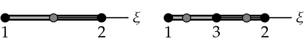
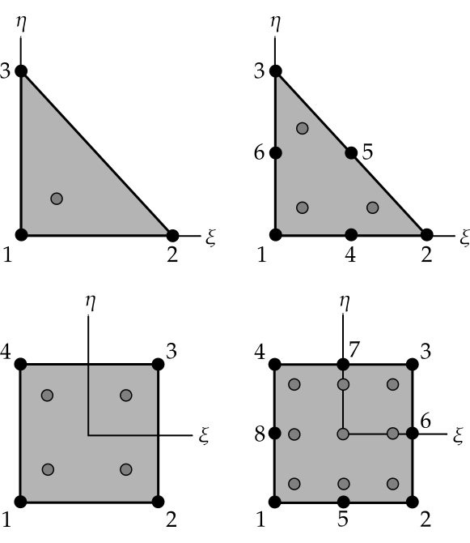
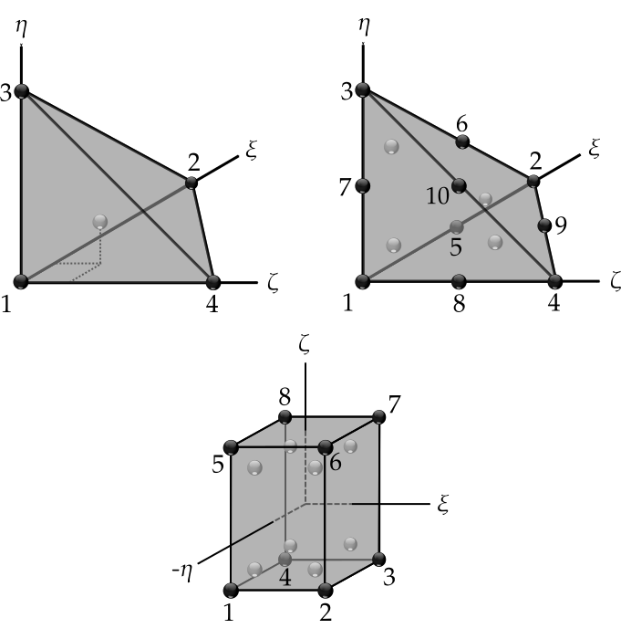
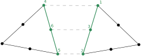
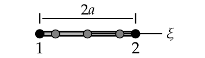

Basic types
===========

Using Arrays
------------

Data in ``Akantu`` can be stored in data containers implemented by the
:cpp:class:`akantu::Array` class. In its most basic usage, the :cpp:class:`Array
<akantu::Array>` class implemented in \akantu is similar to the ``std::vector``
class of the Standard Template Library (STL) for C++. A simple :cpp:class:`Array
<akantu::Array>` containing a sequence of ``nb_element`` values (of a given
type) can be generated with::

  Array<type> example_array(nb_element);

where ``type`` usually is :cpp:type:`Real <akantu::Real>`, :cpp:type:`Int
<akantu::Int>`, :cpp:type:`UInt <akantu::UInt>` or ``bool``. Each value is
associated to an index, so that data can be accessed by typing::

  auto & val = example_array(index);

``Arrays`` can also contain tuples of values for each index. In that case, the
number of components per tuple must be specified at the :cpp:class:`Array
<akantu::Array>` creation. For example, if we want to create an
:cpp:class:`Array <akantu::Array>` to store the coordinates (sequences of three
values) of ten nodes, the appropriate code is the following::

  UInt nb_nodes = 10;
  Int spatial_dimension = 3;

  Array<Real> position(nb_nodes, spatial_dimension);

In this case the :math:`x` position of the eighth node number will be given
by ``position(7, 0)`` (in C++, numbering starts at 0 and not 1). If
the number of components for the sequences is not specified, the
default value of 1 is used. Here is a list of some basic operations
that can be performed on :cpp:class:`Array <akantu::Array>`:

  - :cpp:func:`resize(size) <akantu::ArrayDataLayer::resize>` change the size of
    the :cpp:class:`Array <akantu::Array>`.
  - :cpp:func:`clear <akantu::Array::clear>` reset the size of the
    :cpp:class:`Array <akantu::Array>` to zero. (*warning* this changed in >
    v4.0)
  - :cpp:func:`set(t) <akantu::Array::set>` set all entries of the
    :cpp:class:`Array <akantu::Array>` to ``t``.
  - :cpp:func:`copy(const Array & other) <akantu::Array::copy>` copy another
    :cpp:class:`Array <akantu::Array>` into the current one. The two
    :cpp:class:`Arrays <akantu::Array>` should have the same number of
    components.
  - :cpp:func:`push_back(tuple) <akantu::Array::push_back>` append a tuple with
    the correct number of components at the end of the :cpp:class:`Array <akantu::Array>`.
  - :cpp:func:`erase(i) <akantu::Array::erase>` erase the value at the i-th position.
  - :cpp:func:`find(value) <akantu::Array::find>` search ``value`` in the
    current :cpp:class:`Array <akantu::Array>`. Return position index of the
    first occurence or -1 if not found.
  - :cpp:func:`storage() <akantu::Array::storage>` Return the address of the
    allocated memory of the :cpp:class:`Array <akantu::Array>`.

Array iterators
---------------

It is very common in ``Akantu`` to loop over arrays to perform a specific treatment.
This ranges from geometric calculation on nodal quantities to tensor algebra (in
constitutive laws for example). The :cpp:class:`Array <akantu::Array>` object
has the possibility to request iterators in order to make the writing of loops
easier and enhance readability. For instance, a loop over the nodal coordinates
can be performed like::

  // accessing the nodal coordinates Array
  // with spatial_dimension components
  const auto & nodes = mesh.getNodes();

  for (const auto & coords : make_view(nodes, spatial_dimension)) {
    // do what you need ....
  }

In that example, each ``coords`` is a :cpp:class:`Vector\<Real\> <akantu::Vector>`
containing geometrical array of size ``spatial_dimension`` and the iteration is
conveniently performed by the :cpp:class:`Array <akantu::Array>` iterator.

The :cpp:class:`Array <akantu::Array>` object is intensively used to store
second order tensor values. In that case, it should be specified that the
returned object type is a matrix when constructing the iterator. This is done
when calling the :cpp:func:`make_view <akantu::make_view>`. For instance,
assuming that we have a :cpp:class:`Array <akantu::Array>` storing stresses, we
can loop over the stored tensors by::

   for (const auto & stress :
     make_view(stresses, spatial_dimension, spatial_dimension)) {
     // stress is of type `const Matrix<Real>&`
   }

In that last example, the :cpp:class:`Matrix\<Real\> <akantu::Matrix>` objects are
``spatial_dimension`` :math:`\times` ``spatial_dimension`` matrices. The light
objects :cpp:class:`Matrix\<T\> <akantu::Matrix>` and
:cpp:class:`Vector\<T\> <akantu::Vector>` can be used and combined to do most
common linear algebra. If the number of component is 1, it is possible to use
:cpp:func:`make_view <akantu::make_view>` to this effect.


In general, a mesh consists of several kinds of elements. Consequently, the
amount of data to be stored can differ for each element type. The
straightforward example is the connectivity array, namely the sequences of nodes
belonging to each element (linear triangular elements have fewer nodes than,
say, rectangular quadratic elements etc.). A particular data structure called
:cpp:class:`ElementTypeMapArray\<T\> <akantu::ElementTypeMapArray>` is provided
to easily manage this kind of data. It consists of a group of ``Arrays``, each
associated to an element type. The following code can retrieve the
:cpp:class:`ElementTypeMapArray\<UInt\> <akantu::ElementTypeMapArray>` which
stores the connectivity arrays for a mesh::

  const ElementTypeMapArray<UInt> & connectivities =
    mesh.getConnectivities();

Then, the specific array associated to a given element type can be obtained by::

  const Array<UInt> & connectivity_triangle =
    connectivities(_triangle_3);

where the first order 3-node triangular element was used in the presented piece
of code.

Vector & Matrix
```````````````

The :cpp:class:`Array\<T\> <akantu::Array>` iterators as presented in the previous
section can be shaped as :cpp:class:`Vector\<T\> <akantu::Vector>` or
:cpp:class:`Matrix\<T\> <akantu::Matrix>`. This objects represent 1st and 2nd order
tensors. As such they come with some functionalities that we will present a bit
more into detail in this here.


``Vector<T>``
'''''''''''''

- Accessors:

  - :cpp:func:`v(i) <akantu::Vector::operator()>` gives the ``i`` -th
    component of the vector ``v``
  - :cpp:func:`v[i] <akantu::Vector::operator[]>` gives the ``i`` -th
    component of the vector ``v``
  - :cpp:func:`v.size() <akantu::Vector::size>` gives the number of component

- Level 1: (results are scalars)

  - :cpp:func:`v.norm() <akantu::Vector::norm>` returns the geometrical norm
    (:math:`L_2`)
  - :cpp:func:`v.norm\<N\>() <akantu::Vector::norm<>>` returns the :math:`L_N`
    norm defined as :math:`\left(\sum_i |v(i)|^N\right)^{1/N}`. N can take any
    positive integer value. There are also some particular values for the most
    commonly used norms, ``L_1`` for the Manhattan norm, ``L_2`` for the
    geometrical norm and ``L_inf`` for the norm infinity.
  - :cpp:func:`v.dot(x) <akantu::Vector::dot>` return the dot product of
    ``v`` and ``x``
  - :cpp:func:`v.distance(x) <akantu::Vector::distance>` return the
    geometrical norm of :math:`v - x`

- Level 2: (results are vectors)

  - :cpp:func:`v += s <akantu::Vector::operator+=>`,
    :cpp:func:`v -= s <akantu::Vector::operator-=>`,
    :cpp:func:`v *= s <akantu::Vector::operator*=>`,
    :cpp:func:`v /= s <akantu::Vector::operator/=>` those are element-wise
    operators that sum, substract, multiply or divide all the component of ``v``
    by the scalar ``s``
  - :cpp:func:`v += x <akantu::Vector::operator+=>`, :cpp:func:`v -= x
    <akantu::Vector::operator-=>` sums or substracts the vector ``x`` to/from
    ``v``
  - :cpp:func:`v.mul(A, x, alpha) <akantu::Vector::mul>` stores the result of
    :math:`\alpha \boldsymbol{A} \vec{x}` in ``v``, :math:`\alpha` is equal to 1
    by default
  - :cpp:func:`v.solve(A, b) <akantu::Vector::solve>` stores the result of
    the resolution of the system :math:`\boldsymbol{A} \vec{x} = \vec{b}` in ``v``
  - :cpp:func:`v.crossProduct(v1, v2) <akantu::Vector::crossProduct>`
    computes the cross product of ``v1`` and ``v2`` and stores the result in
    ``v``

``Matrix<T>``
'''''''''''''

- Accessors:

  - :cpp:func:`A(i, j) <akantu::Matrix::operator()>` gives the component
    :math:`A_{ij}` of the matrix ``A``
  - :cpp:func:`A(i) <akantu::Matrix::operator()>` gives the :math:`i^{th}`
    column of the matrix as a ``Vector``
  - :cpp:func:`A[k] <akantu::Matrix::operator[]>` gives the :math:`k^{th}`
    component of the matrix, matrices are stored in a column major way, which
    means that to access :math:`A_{ij}`, :math:`k = i + j M`
  - :cpp:func:`A.rows() <akantu::Matrix::rows>` gives the number of rows of
    ``A`` (:math:`M`)
  - :cpp:func:`A.cols() <akantu::Matrix::cols>` gives the number of columns
    of ``A`` (:math:`N`)
  - :cpp:func:`A.size() <akantu::Matrix::size>` gives the number of component
    in the matrix (:math:`M \times N`)

- Level 1: (results are scalars)

  - :cpp:func:`A.norm() <akantu::Matrix::norm>` is equivalent to
    ``A.norm<L_2>()``
  - :cpp:func:`A.norm\<N\>() <akantu::Matrix::norm<>>` returns the :math:`L_N`
    norm defined as :math:`\left(\sum_i\sum_j |A(i,j)|^N\right)^{1/N}`. N can take
    any positive integer value. There are also some particular values for the most
    commonly used norms, ``L_1`` for the Manhattan norm, ``L_2`` for the
    geometrical norm and ``L_inf`` for the norm infinity.
  - :cpp:func:`A.trace() <akantu::Matrix::trace>` return the trace of ``A``
  - :cpp:func:`A.det() <akantu::Matrix::det>` return the determinant of ``A``
  - :cpp:func:`A.doubleDot(B) <akantu::Matrix::doubleDot>` return the double
    dot product of ``A`` and ``B``, :math:`\mat{A}:\mat{B}`

- Level 3: (results are matrices)

  - :cpp:func:`A.eye(s) <akantu::Matrix::eye>`, ``Matrix<T>::eye(s)``
    fills/creates a matrix with the :math:`s\mat{I}` with :math:`\mat{I}` the
    identity matrix
  - :cpp:func:`A.inverse(B) <akantu::Matrix::inverse>` stores
    :math:`\mat{B}^{-1}` in ``A``
  - :cpp:func:`A.transpose() <akantu::Matrix::transpose>` returns
    :math:`\mat{A}^{t}`
  - :cpp:func:`A.outerProduct(v1, v2) <akantu::Matrix::outerProduct>` stores
    :math:`\vec{v_1} \vec{v_2}^{t}` in ``A``
  - :cpp:func:`C.mul\<t_A, t_B\>(A, B, alpha) <akantu::Matrix::mul>`: stores
    the result of the product of ``A`` and code{B} time the scalar ``alpha`` in
    ``C``. ``t_A`` and ``t_B`` are boolean defining if ``A`` and ``B`` should be
    transposed or not.

    +----------+----------+--------------+
    |``t_A``   |``t_B``   |result        |
    |          |          |              |
    +----------+----------+--------------+
    |false     |false     |:math:`\mat{C}|
    |          |          |= \alpha      |
    |          |          |\mat{A}       |
    |          |          |\mat{B}`      |
    |          |          |              |
    +----------+----------+--------------+
    |false     |true      |:math:`\mat{C}|
    |          |          |= \alpha      |
    |          |          |\mat{A}       |
    |          |          |\mat{B}^t`    |
    |          |          |              |
    +----------+----------+--------------+
    |true      |false     |:math:`\mat{C}|
    |          |          |= \alpha      |
    |          |          |\mat{A}^t     |
    |          |          |\mat{B}`      |
    |          |          |              |
    +----------+----------+--------------+
    |true      |true      |:math:`\mat{C}|
    |          |          |= \alpha      |
    |          |          |\mat{A}^t     |
    |          |          |\mat{B}^t`    |
    +----------+----------+--------------+

  - :cpp:func:`A.eigs(d, V) <akantu::Matrix::eigs>` this method computes the
    eigenvalues and eigenvectors of ``A`` and store the results in ``d`` and
    ``V`` such that :math:`d(i) = \lambda_i` and :math:`V(i) = \vec{v_i}` with
    :math:`\mat{A}\vec{v_i} = \lambda_i\vec{v_i}` and :math:`\lambda_1 > ... >
    \lambda_i > ... > \lambda_N`


.. _sect-common-groups:

Mesh
----


Manipulating group of nodes and/or elements
```````````````````````````````````````````

``Akantu`` provides the possibility to manipulate subgroups of elements and
nodes. Any :cpp:class:`ElementGroup <akantu::ElementGroup>` and/or
:cpp:class:`NodeGroup <akantu::NodeGroup>` must be managed by a
:cpp:class:`GroupManager <akantu::GroupManager>`. Such a manager has the role to
associate group objects to names. This is a useful feature, in particular for
the application of the boundary conditions, as will be demonstrated in section
:ref:`sect-smm-boundary`. To most general group manager is the :cpp:class:`Mesh
<akantu::Mesh>` class which inherits from :cpp:class:`GroupManager
<akantu::GroupManager>`.

For instance, the following code shows how to request an element group
to a mesh:

.. code-block:: c++

  // request creation of a group of nodes
  NodeGroup & my_node_group = mesh.createNodeGroup("my_node_group");
  // request creation of a group of elements
  ElementGroup & my_element_group = mesh.createElementGroup("my_element_group");

  /* fill and use the groups */


The ``NodeGroup`` object
''''''''''''''''''''''''

A group of nodes is stored in :cpp:class:`NodeGroup <akantu::NodeGroup>`
objects. They are quite simple objects which store the indexes of the selected
nodes in a :cpp:class:`Array\<UInt\> <akantu::Array>`. Nodes are selected by
adding them when calling :cpp:func:`add <akantu::NodeGroup::add>`. For instance
you can select nodes having a positive :math:`X` coordinate with the following
code:

.. code-block:: c++

  const auto & nodes = mesh.getNodes();
  auto & group = mesh.createNodeGroup("XpositiveNode");

  for (auto && data : enumerate(make_view(nodes, spatial_dimension))){
    auto node = std::get<0>(data);
    const auto & position = std::get<1>(data);
    if (position(0) > 0) group.add(node);
  }


The ``ElementGroup`` object
'''''''''''''''''''''''''''

A group of elements is stored in :cpp:class:`ElementGroup
<akantu::ElementGroup>` objects. Since a group can contain elements of various
types the :cpp:class:`ElementGroup <akantu::ElementGroup>` object stores indexes
in a :cpp:class:`ElementTypeMapArray\<UInt\> <akantu::ElementTypeMapArray>`
object. Then elements can be added to the group by calling :cpp:func:`add
<akantu::ElementGroup::add>`.

For instance, selecting the elements for which the barycenter of the
nodes has a positive :math:`X` coordinate can be made with:

.. code-block:: c++

   auto & group = mesh.createElementGroup("XpositiveElement");
   Vector<Real> barycenter(spatial_dimension);

   for_each_element(mesh, [&](auto && element) {
     mesh.getBarycenter(element, barycenter);
     if (barycenter(_x) > 0.) { group.add(element); }
   });


FEEngine
--------

The :cpp:class:`FEEngine<akantu::FEEngine>` interface is dedicated to handle the
finite-element approximations and the numerical integration of the weak form. As
we will see in Chapter :doc:`./solidmechanicsmodel`,
:cpp:class:`Model<akantu::Model>` creates its own
:cpp:class:`FEEngine<akantu::FEEngine>` object so the explicit creation of the
object is not required.

Mathematical Operations
```````````````````````

Using the :cpp:class:`FEEngine<akantu::FEEngine>` object, one can compute a interpolation,
an integration or a gradient.A simple example is given below:

.. code-block:: c++

   // having a FEEngine object
   auto fem = std::make_unique<FEEngineTemplate<IntegratorGauss, ShapeLagrange>>(my_mesh, dim, "my_fem");
   // instead of this, a FEEngine object can be get using the model:
   // model.getFEEngine()

   // compute the gradient
   Array<Real> u;       // append the values you want
   Array<Real> nablauq; // gradient array to be computed
   // compute the gradient
   fem->gradientOnIntegrationPoints(const Array<Real> & u, Array<Real> & nablauq,
                const UInt nb_degree_of_freedom,
                ElementType type);

   // interpolate
   Array<Real> uq; // interpolated array to be computed
                   // compute the interpolation
   fem->interpolateOnIntegrationPoints(const Array<Real> & u, Array<Real> & uq,
                UInt nb_degree_of_freedom,
                ElementType type);

   // interpolated function can be integrated over the elements
   Array<Real> int_val_on_elem;
   // integrate
   fem->integrate(const Array<Real> & uq, Array<Real> & int_uq,
                UInt nb_degree_of_freedom, ElementType type);


Another example below shows how to integrate stress and strain fields over
elements assigned to a particular material:

.. code-block:: c++

   UInt sp_dim{3};                  // spatial dimension
   UInt m{1};                       // material index of interest
   const auto type{_tetrahedron_4}; // element type

   // get the stress and strain arrays associated to the material index m
   const auto & strain_vec = model.getMaterial(m).getGradU(type);
   const auto & stress_vec = model.getMaterial(m).getStress(type);

   // get the element filter for the material index
   const auto & elem_filter = model.getMaterial(m).getElementFilter(type);

   // initialize the integrated stress and strain arrays
   Array<Real> int_strain_vec(elem_filter.getSize(), sp_dim * sp_dim,
                "int_of_strain");
   Array<Real> int_stress_vec(elem_filter.getSize(), sp_dim * sp_dim,
                "int_of_stress");

   // integrate the fields
   model.getFEEngine().integrate(strain_vec, int_strain_vec, sp_dim * sp_dim, type,
                _not_ghost, elem_filter);
   model.getFEEngine().integrate(stress_vec, int_stress_vec, sp_dim * sp_dim, type,
                _not_ghost, elem_filter);


.. _sec-elements:

Elements
````````

The base for every Finite-Elements computation is its mesh and the elements that
are used within that mesh. The element types that can be used depend on the
mesh, but also on the dimensionality of the problem (1D, 2D or 3D). In
``Akantu``, several iso-parametric Lagrangian element types are supported (and
one serendipity element). Each of these types is discussed in some detail below,
starting with the 1D-elements all the way to the 3D-elements. More detailed
information (shape function, location of Gaussian quadrature points, and so on)
can be found in Appendix app:elements.

Iso-parametric Elements
'''''''''''''''''''''''

1D
""""

There are two types of iso-parametric elements defined in 1D. These element
types are called :cpp:enumerator:`_segment_2 <akantu::_segment_2>` and
:cpp:enumerator:`_segment_3 <akantu::_segment_3>`, and are depicted
schematically in :numref:`fig-elements-1D`. Some of the basic properties of
these elements are listed in :numref:`tab-elements-1D`.

.. _fig-elements-1D:


            Schematic overview of the two 1D element types in ``Akantu``. In each
            element, the node numbering as used in ``Akantu`` is indicated and also the
            quadrature points are highlighted (gray circles).


.. _tab-elements-1D:
.. csv-table:: Some basic properties of the two 1D iso-parametric elements in ``Akantu``
               :header: "Element type", "Order", "#nodes", "#quad points"

               ":cpp:enumerator:`_segment_2 <akantu::_segment_2>`", "linear", 2, 1
               ":cpp:enumerator:`_segment_3 <akantu::_segment_3>`", "quadratic", 3, 2

2D
""""

There are four types of iso-parametric elements defined in 2D. These element
types are called :cpp:enumerator:`_triangle_3 <akantu::_triangle_3>`,
:cpp:enumerator:`_triangle_6 <akantu::_triangle_6>`,
:cpp:enumerator:`_quadrangle_4 <akantu::_quadrangle_4>` and
:cpp:enumerator:`_quadrangle_8 <akantu::_quadrangle_8>`, and all of them are
depicted in :numref:`fig-elements-2D`. As with the 1D elements, some of the most
basic properties of these elements are listed in :numref:`tab-elements-2D`. It
is important to note that the first element is linear, the next two quadratic
and the last one cubic. Furthermore, the last element type (``_quadrangle_8``)
is not a Lagrangian but a serendipity element.

.. _fig-elements-2D:


            Schematic overview of the four 2D element types in ``Akantu``. In each
            element, the node numbering as used in ``Akantu`` is indicated and also the
            quadrature points are highlighted (gray circles).


.. _tab-elements-2D:
.. csv-table:: Some basic properties of the 2D iso-parametric elements in ``Akantu``
               :header: "Element type", "Order", "#nodes", "#quad points"

               ":cpp:enumerator:`_triangle_3 <akantu::_triangle_3>`", "linear", 3, 1
               ":cpp:enumerator:`_triangle_6 <akantu::_triangle_6>`", "quadratic", 6, 3
               ":cpp:enumerator:`_quadrangle_4 <akantu::_quadrangle_4>`", "linear", 4, 4
               ":cpp:enumerator:`_quadrangle_8 <akantu::_quadrangle_8>`", "quadratic", 8, 9

3D
````

In ``Akantu``, there are three types of iso-parametric elements defined in 3D.
These element types are called :cpp:enumerator:`_tetrahedron_4
<akantu::_tetrahedron_4>`, :cpp:enumerator:`_tetrahedron_10
<akantu::_tetrahedron_10>` and :cpp:enumerator:`_hexadedron_8
<akantu::_hexadedron_8>`, and all of them are depicted schematically in
:numref:`fig-elements-3D`. As with the 1D and 2D elements some of the most basic
properties of these elements are listed in :numref:`tab-elements-3D`.

.. _fig-elements-3D:


            Schematic overview of the three 3D element types in ``Akantu``. In each
            element, the node numbering as used in ``Akantu`` is indicated and also the
            quadrature points are highlighted (gray circles).

.. _tab-elements-3D:
.. csv-table:: Some basic properties of the 3D iso-parametric elements in ``Akantu``
               :header: "Element type", "Order", "#nodes", "#quad points"

               ":cpp:enumerator:`_tetrahedron_4 <akantu::_tetrahedron_4>`", "linear", 4, 1
               ":cpp:enumerator:`_tetrahedron_10 <akantu::_tetrahedron_10>`", "quadratic", 10, 4
               ":cpp:enumerator:`_hexadedron_8 <akantu::_hexadedron_8>`", "cubic", 8, 8

Cohesive Elements
'''''''''''''''''

The cohesive elements that have been implemented in ``Akantu`` are based
on the work of Ortiz and Pandolfi :cite:`ortiz1999`. Their main
properties are reported in :numref:`tab-coh-cohesive_elements`.

.. _fig-smm-coh-cohesive2d:


            Cohesive element in 2D for quadratic triangular elements T6.

.. _tab-coh-cohesive_elements:
.. csv-table:: Some basic properties of the cohesive elements in ``Akantu``.
               :header: "Element type", "Facet type", "Order", "#nodes", "#quad points"

               ":cpp:enumerator:`_cohesive_1d_2 <_cohesive_1d_2>`", ":cpp:enumerator:`_point_1 <akantu::_point_1>`", "linear", 2, 1
               ":cpp:enumerator:`_cohesive_2d_4 <akantu::_cohesive_2d_4>`", ":cpp:enumerator:`_segment_2  <akantu::_segment_2>`", "linear", 4, 1
               ":cpp:enumerator:`_cohesive_2d_6 <akantu::_cohesive_2d_6>`", ":cpp:enumerator:`_segment_3  <akantu::_segment_3>`", "quadratic", 6, 2
               ":cpp:enumerator:`_cohesive_3d_6 <akantu::_cohesive_3d_6>`", ":cpp:enumerator:`_triangle_3  <akantu::_triangle_3>`","linear", 6, 1
               ":cpp:enumerator:`_cohesive_3d_12 <akantu::_cohesive_3d_12>`", ":cpp:enumerator:`_triangle_6  <akantu::_triangle_6>`", "quadratic", 12, 3


Structural Elements
'''''''''''''''''''

Bernoulli Beam Elements
"""""""""""""""""""""""

These elements allow to compute the displacements and rotations of
structures constituted by Bernoulli beams. ``Akantu`` defines them for
both 2D and 3D problems respectively in the element types
:cpp:enumerator:`_bernoulli_beam_2 <akantu::_bernoulli_beam_2>` and :cpp:enumerator:`_bernoulli_beam_3 <akantu::_bernoulli_beam_3>`. A
schematic depiction of a beam element is shown in
:numref:`fig-elements-bernoulli` and some of its properties are
listed in :numref:`tab-elements-bernoulli`.

.. note::
   Beam elements are of mixed order: the axial displacement is
   linearly interpolated while transverse displacements and rotations
   use cubic shape functions.

.. _fig-elements-bernoulli:


            Schematic depiction of a Bernoulli beam element (applied to 2D and
            3D) in ``Akantu``. The node numbering as used in ``Akantu`` is
            indicated, and also the quadrature points are highlighted (gray
            circles).

.. _tab-elements-bernoulli:
.. csv-table:: Some basic properties of the beam elements in ``Akantu``
   :header: "Element type", "Dimension", "# nodes", "# quad. points", "# d.o.f."

   ":cpp:enumerator:`_bernoulli_beam_2 <akantu::_bernoulli_beam_2>`", "2D", 2, 3, 6
   ":cpp:enumerator:`_bernoulli_beam_3 <akantu::_bernoulli_beam_3>`", "3D", 2, 3, 12
