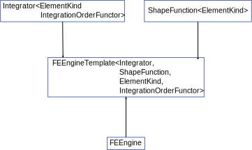

.. _sect-dev-manual:

Developer Manual
================


Code Philosophy
---------------

Main design choices
```````````````````

Coding conventions
``````````````````

Code structure overview
-----------------------

Global structure
````````````````

FEEngine structure
``````````````````

The :cpp:class:`FEEngine <akantu::FEEngine>` is the base class for all Finite
element computation. It has the global interface for ``integration``,
``interpolation`` and ``gradient`` computations.

It is derived in the :cpp:class:`FEEngineTemplate <akantu::FEEngineTemplate>`
class that contain the actual implementation of this operators. The
implementation uses the :cpp:class:`Integrator <akantu::Integrator>` and
:cpp:class:`ShapeFunction <akantu::ShapeFunction>` classes has helper classes to
do the required operations.



Integrator
""""""""""

There is currently only one implementation of the :cpp:class:`Integrator
<akantu::Integrator>` which is the :cpp:class:`IntegratorGauss
<akantu::IntegratorGauss>`

This integrator implements the integration functions using the Gauss quadrature.
The position and weight of the quadrature points are pre-computed in the
:cpp:class:`GaussIntegrationTypeData<GaussIntegrationType, nb_points>
<akantu::GaussIntegrationTypeData>` and entered in
``src/fe_engine/gauss_integration.cc``. For some element types this information
are deduced from other types, for examples for ``quadrangles`` and
``hexahedron`` the points defined for ``segment`` are used.

Shape Functions
"""""""""""""""


Element Classes
"""""""""""""""


Solver structure
````````````````

Time step solver
""""""""""""""""

Non linear solver
"""""""""""""""""

Linear solver
"""""""""""""

Model structure
```````````````

Constitutive laws
"""""""""""""""""

Coupled models
""""""""""""""
