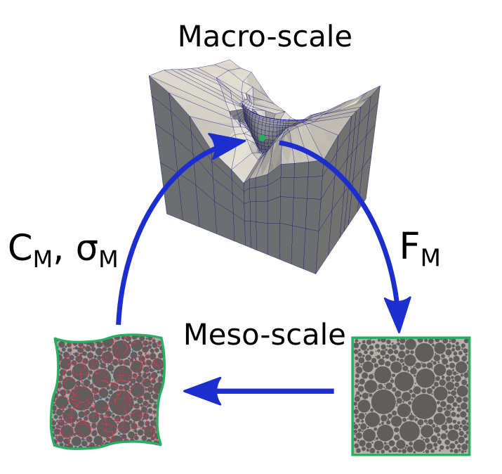

Multi-Scale Tools
=================

The multi-scale tools is a general name for a package which handles the
multi-scale model and the homogenisation utilities within Akantu. This
package depends on the :cpp:class:`SolidMechanicsModel
<akantu::SolidMechanicsModel>` and
:cpp:class:`SolidMechanicsModelCohesive
<akantu::SolidMechanicsModelCohesive>`.

Theory
------

.. _fig-fe2-concept:

   Schematic illustration of the multi-scale homogenisation scheme.

Current model comprises a first-order multi-scale model with `FE`:sup:`2`
homogenisation scheme to couple the macro- and the meso-scale. This
method consists of two coupled finite element problems, one for the
macro-scale and the other for the fine scale, *i.e.* the scale of the
underlying representative volume element (RVE), which determines the
effective material behaviour. The concept of a first-order `FE`:sup:`2`
homogenisation scheme for small deformations is illustrated in
:numref:`fig-fe2-concept`

The subscripts :math:`M` and :math:`m` are used to denote physical
quantities at the macro- and the meso-scale, respectively. For instance,
:math:`\boldsymbol{\sigma}_M` is the macroscopic stress for which the
mesoscopic counterpart is :math:`\boldsymbol{\sigma}_m`. Every Gauss
integration point of the macro-scale FE problem is coupled to a
meso-structural RVE of concrete. Quasi-static conditions are assumed at
both scales because the advancement of ASR is slow. The two scales are
coupled through the macroscopic deformation gradient
:math:`\boldsymbol{F}_M`, the effective stiffness tensor
:math:`\mathbb{C}_M`, and the macroscopic stress
:math:`\boldsymbol{\sigma}_{M}`. The boundary conditions of the
meso-scale boundary value problem (BVP) are a function of
:math:`\boldsymbol{F}_M`. The BVP is solved for the given boundary
conditions, and the effective stiffness tensor :math:`\mathbb{C}_M` and
the homogenised mesoscopic stress :math:`\boldsymbol{\sigma}_{M}` are
then computed and passed back to the macro-scale. The balance between the
internal and external forces at the macro-scale is verified. In the case
of imbalance, the whole procedure is repeated in the next iteration. As a
convergence criterion, we use the norm of the difference between the
internal and external forces, also known as *residual*.

For a macro-scale body :math:`\Omega_M` with its boundary
:math:`\Gamma_M`, which consists of the Neumann boundary
:math:`\Gamma_{M,t}` and the Dirichlet boundary :math:`\Gamma_{M,u}`, the
principle of virtual work reads as:

.. math::
  \delta W_M = \int_{\Omega_{M}}\boldsymbol{\sigma}_M:\delta\boldsymbol{\varepsilon}_M\:d\Omega
  -\int_{\Omega_{M}}\boldsymbol{b}_M\cdot\delta\boldsymbol{u}_M \:d\Omega
  -\int_{\Gamma_{M,t}}\boldsymbol{t}_M\cdot\delta\boldsymbol{u}_M \:d\Gamma=0

where :math:`\delta W_M`, :math:`\boldsymbol{b}_M` and
:math:`\boldsymbol{t}_M` denote the macroscopic virtual work, macroscopic
body force and macroscopic traction, and
:math:`\delta\boldsymbol{\varepsilon}_M` and
:math:`\delta\boldsymbol{u}_M` the macroscopic virtual strain and
macroscopic virtual displacement. No assumptions are introduced regarding
:math:`\boldsymbol{\sigma}_{M}`. Instead, it is obtained directly from
the meso-scale computations.

The current macroscopic state enters the RVE computations via the
periodic boundary conditions. They are defined as follows:

.. math::
    \boldsymbol{u}_{m,i}=(\boldsymbol{F}_M-\boldsymbol{1})\boldsymbol{x}_{m,i}\quad\text{for } i=1,2,3,4 \\
    \boldsymbol{u}_{\Gamma_{m,34}}=\boldsymbol{u}_{\Gamma_{m,12}}+\boldsymbol{u}_{m,4}-\boldsymbol{u}_{m,1} \\
    \boldsymbol{u}_{\Gamma_{m,23}}=\boldsymbol{u}_{\Gamma_{m,14}}+\boldsymbol{u}_{m,2}-\boldsymbol{u}_{m,1}

where :math:`\boldsymbol{F}_M` denotes the deformation gradient at the
corresponding macroscopic material point, :math:`\boldsymbol{u}_{m,i}` is
the displacement of the corner node :math:`i`, and :math:`\Gamma_{m,12}`,
:math:`\Gamma_{m,23}`, :math:`\Gamma_{m,34}` and :math:`\Gamma_{m,14}`
are the boundaries of the RVE. While the terms
:math:`[\boldsymbol{u}_{m,4}-\boldsymbol{u}_{m,1}]` and
:math:`[\boldsymbol{u}_{m,2}-\boldsymbol{u}_{m,1}]` represent the
macroscopic component of displacement,
:math:`\boldsymbol{u}_{\Gamma_{m,12}}` and
:math:`\boldsymbol{u}_{\Gamma_{m,14}}` are the periodic
micro-fluctuations at the boundary pairs (:math:`\Gamma_{m,12}` and
:math:`\Gamma_{m,34}`) and (:math:`\Gamma_{m,14}` and
:math:`\Gamma_{m,23}`), correspondingly.

The stress distribution inside the RVE is obtained through the solution
of the meso-scale boundary value problem. For the macro-scale, the
average stress response of the RVE needs to be determined. This can be
done using the *Hill-Mandel* macro-homogeneity condition

.. math::
  \frac{1}{\Omega_{m}}\int_{\Omega_m}\boldsymbol{\sigma}_m:\boldsymbol{\varepsilon}_m\:\mathrm{d}\Omega_{m} = \boldsymbol{\sigma}_M:\boldsymbol{\varepsilon}_M

The periodic-fluctuations boundary conditions fulfil the *Hill-Mandel*
condition and yield equivalence between the macroscopic stress and volume
average of the mesoscopic stresses inside the RVE:

.. math::
   \boldsymbol{\sigma}_M = \int_{\Gamma_m}\boldsymbol{t}_m \otimes
   \boldsymbol{x}_m\:\mathrm{d}\Gamma_m =
   \frac{1}{\Omega_m}\int_{\Omega_m}\boldsymbol{\sigma}_m\:\mathrm{d}\Omega_m.

where \boldsymbol{t}_m and \boldsymbol{x}_m are the tractions and
displacements along the boundaries of the RVE. The above equation is used
for the stress homogenisation at the meso-scale.

For the macroscale analysis, a tangent stiffness tensor is required at
each integration point. The effective stiffness tensor is defined by the
effective stress-strain relation

.. math::
   \boldsymbol{\sigma}_M = \mathbb{C}_M \boldsymbol{\varepsilon}_M

Both, :math:`\boldsymbol{\sigma}_M` and
:math:`\boldsymbol{\varepsilon}_M` are symmetric second-order tensors
with three independent components in 2D. Stiffness homogenisation is done
through the virtual tests approach. In the scope of this method, the
results of three virtual loading tests, linearly independent from each
other, are required to determine the symmetric fourth-order tensor
:math:`\mathbb{C}_M`. For more details on the theory of this multi-scale
model please see :cite:`gallyamov2020`.

Components of the Multi-scale model
-----------------------------------

The multi-scale model is based on three main classes in Akantu:
:cpp:class:`RVETools <akantu::RVETools>`,
:cpp:class:`SolidMechanicsModelRVE <akantu::SolidMechanicsModelRVE>` and
:cpp:class:`MaterialFE2 <akantu::MaterialFE2>`. Functionality of each one is described below:

* :cpp:class:`RVETools <akantu::RVETools>` is comprising all the various
  tools and functions to operate at a single RVE. This class could be
  instantiated at a simple
  :cpp:class:`SolidMechanicsModel<akantu::SolidMechanicsModel>` and does
  not require a full multi-scale model. This class comprises functions
  allowing to apply different internal and external boundary conditions,
  homogenise stiffness, stress and strain, quantify average properties of
  the model.

* :cpp:class:`SolidMechanicsModelRVE<akantu::SolidMechanicsModelRVE>` is
  a subclass of
  :cpp:class:`SolidMechanicsModel<akantu::SolidMechanicsModel>` with
  periodic-fluctuations boundary conditions, predefined dumping fields
  and solver options, and override functions for assembling the internal
  forces. Instantiating an object of this class creates a single RVE as
  well as RVE Tools assigned to
  it. :cpp:class:`SolidMechanicsModelRVE<akantu::SolidMechanicsModelRVE>`
  could be instantiated directly by the user or by the
  :cpp:class:`MaterialFE2 <akantu::MaterialFE2>` class.

* :cpp:class:`MaterialFE2 <akantu::MaterialFE2>` is a macroscopic
  material which handles the macro-meso link. Each macroscopic
  integration point of the :cpp:class:`MaterialFE2<akantu::MaterialFE2>`
  has a
  :cpp:class:`SolidMechanicsModelRVE<akantu::SolidMechanicsModelRVE>`
  asigned. There is no direct access to the individual
  :cpp:class:`SolidMechanicsModelRVE<akantu::SolidMechanicsModelRVE>` and
  the user has to operate :cpp:class:`MaterialFE2<akantu::MaterialFE2>`
  in order to dump RVEs or advance the loading.

  
Using the Multi-Scale Model
---------------------------

The multi-scale model is established by instantiating the
:cpp:class:`MaterialFE2<akantu::MaterialFE2>`. The properties of this
material are precised within an input file with the following convention

.. code-block:: python
  
  material material_FE2 [
	 name = value
	 element_type = value # Currently only _triangle_3 is supported
	 mesh_file = file_name.extension
	 nb_expanding_elements = value
         eps_inf = value # Asymptotic strain value
         time_lat_ref = value # Latency time in days
         time_ch_ref = value # Characteristic time in days
         U_C = value # Energy constant C
         U_L = value # Energy constant L
         T_ref = value # Reference temperature in Kelvins
         reset_damage = false # Activates the damage reset to the previously converged values on each iteration
	 ...
	 ]

where ... stands for the other properties of the parent classes (*e.g*
``rho``, ``E``, ``nu``, etc.). This configuration of the material entry
is designed for a specific application problem, namely alkali-silica
reaction (ASR) in concrete, where the expansive loading is applied at a
number of expanding elements randomly distributed within aggregate
material. Such parameters as ``eps_inf``, ``time_lat_ref``,
``time_ch_ref``, ``U_C``, ``U_L`` and ``T_ref`` are the parameters of an
asymptotic ASR expansion law described in :cite:`ulm2000`.

``mesh_file`` is the name of the mesh that will be used at the fine
scale. This 2D mesh should have a rectangular (or square) shape and have
symmetrically placed nodes at opposite sides. The mesh has to have the
boundaries composed of the physical entities named ``top``, ``bottom``,
``left`` and ``right``. This names are later used for setting up the
periodic pairs.

The macro-scale mesh has to be entirely or partially composed of the
:cpp:class:`MaterialFE2 <akantu::MaterialFE2>`. In order to assign
correct material based on the names of regions as defined in the mesh
file, :cpp:class:`MeshDataMaterialSelector
<akantu::MeshDataMaterialSelector>` has to be set as the material
selector::

       auto &&mat_selector = std::make_shared<MeshDataMaterialSelector<std::string>>("physical_names", model);
       model.setMaterialSelector(mat_selector);

When running the multi-scale job in parallel, by default the macro-scale
problem will be equally distributed between all the processors. As the
multi-scale material is heavier in computations, more weight could be
assigned to it by calling the :cpp:func:`distribute
<akantu::Mesh::distribute>` function with the following
lambda-expression::
  
       mesh.distribute(_vertex_weight_function = [&mesh](auto &&el) {
       const auto &physical_names = mesh.getData<std::string>("physical_names");
       const auto &id = physical_names(el);
       if (id == "material_FE2_name")
       return 100; # Increased weight for multi-scale material elements
       return 1; # Normal weight for other materials
       });

When these steps are done, the
:cpp:class:`SolidMechanicsModel<akantu::SolidMechanicsModel>` could be
initialised with the static solution scheme::

  s_model.initFull(_analysis_method = _static);

For the user to get an access to :cpp:class:`MaterialFE2
<akantu::MaterialFE2>`, it has to be dynamically casted::
  
  MaterialFE2<spatial_dimension> &mat =
  dynamic_cast<MaterialFE2<spatial_dimension> &>(
  s_model.getMaterial("FE2_mat"));

After this step is done, the user could have access to such functions as
:cpp:func:`getNbRVEs <akantu::MaterialFE2::getNbRVEs>`, :cpp:func:`dump
<akantu::MaterialFE2::dump>`, :cpp:func:`setDirectoryToRveDumper
<akantu::MaterialFE2::setDirectoryToRveDumper>`.

When working with cracks and damage at the meso-scale, the macroscopic
RVEs' stiffness is updated directly by the user. This could be done right
after the static solution for the current external load is completed::

  model.solveStep("static");
  mat.updateStiffness();

External loading (*e.g.* internal pressure) applied at the level of the
RVEs, should be specified through the :cpp:class:`MaterialFE2
<akantu::MaterialFE2>` for each loading step::

  mat.increaseExpansion(time_step_day);

Current implementation considers different types of the internal-pressure
buildup (*e.g.* linear, sigmoidal, temperature-dependent).

By default, :cpp:class:`MaterialFE2 <akantu::MaterialFE2>` assumes that
the RVEs contain at least two materials of class
:cpp:class:`MaterialDamageIterative
<akantu::MaterialDamageIterative>`. Currently they are hard-coded as
``aggregate`` and ``paste`` due to the problem-specific
implementation. For each Newton-Raphson iteration within the macroscopic
:cpp:func:`solveStep <akantu::ModelSolver::solveStep>` operation,
:cpp:func:`computeStress <akantu::MaterialFE2::computeStress>` function
is called. When this function is executed at the :cpp:class:`MaterialFE2
<akantu::MaterialFE2>`, it advances damage within each RVE. The latter is
done in a sequential manner: at each linear step, only portion of the
most damaged finite elements are damaged. This step-wise damaging process
continues up to the moment when no new elements are damaged. Several damaging steps take place in a single Newton-Raphson iteration. 
