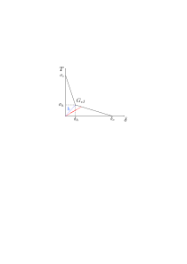

``New Materials``
=================

Extrinsic Bilinear
-------------------------------
The bilinear descending law is represented by the following equation: 

.. math::
   \label{eq:cl:coh_ext_bil}
    \boldsymbol{\sigma} = \begin{cases}
    \sigma_{h} + \dfrac{\delta_h-\delta}{\delta_h}(\sigma_c -\sigma_h) \text{ for opening } \delta=\delta_{max}\leq \delta_h\\
    \dfrac{\delta_c-\delta}{\delta_c-\delta_h}\sigma_h \text{ for opening } \delta=\delta_{max} > \delta_h\\
    \dfrac{\delta}{\delta_{max}}T_{max} \text{ for closing/reopening } \delta < \delta_{max}\\
    \end{cases}

where :math:`\delta_c` represents the effecive separation upon which
the cohesive element is totally damaged, :math:`\delta_{max}` is the
current maximum effective separation, :math:`T_{max}` is the
traction-separation at :math:`\delta=\delta_{max}`, :math:`\delta_h`
and :math:`\sigma_h` indicate the position of the inflection point
determined by :math:`h` and :math:`G_{cI}`

.. math::
   h = \dfrac{\sigma_h}{\delta_h}, \quad   G_{cI} = \dfrac{1}{2}(\sigma_h\delta_c+\sigma_c\delta_h)
  
.. _fig:cohesive:extrinsic-bilinear:

   Bilinear traction-separation law for extrinsic type cohesive element   
