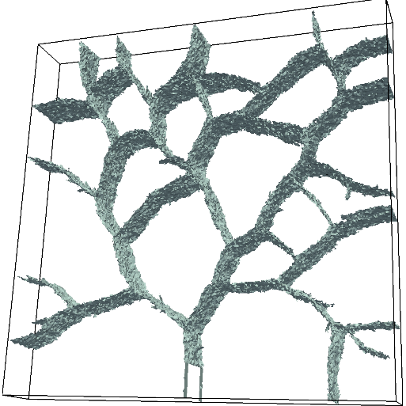
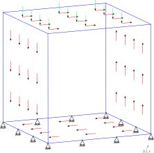
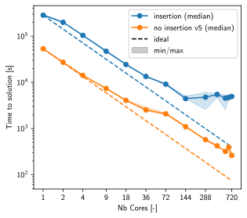

# Summary
Complex, nonlinear and transient phenomena are at the heart of modern research
in mechanics of materials. For example, the buildup and release of elastic
energy at geological fault is what causes earthquakes, and the intricate details
of the slip zone, the propagation of slip fronts and waves radiated through the
various geological media are still active areas of research
[@kammer_propagation_2012;@kammer_existence_2014;@roch_velocity-driven_2022].
Similarly, understanding fracture in heterogeneous materials such as concrete,
masonry or ceramics necessitates the modeling of interaction of crack fronts
with complex materials
[@taheri_mousavi_dynamic_2015;@yilmaz_damage_2017;@cuba_ramos_hpc_2018], the
representation of residual shear stresses in the contact of newly-formed crack
surfaces [@zhang_micro-mechanical_2017;@pundir_coupling_2021], and the accurate
characterization of transient dynamics
[@vocialta_numerical_2018;@corrado_effects_2016] and material structure
evolution [@cuba_ramos_hpc_2018;@gallyamov_multi-scale_2020].

The finite-element method is now ubiquitous in virtually all areas of solid
mechanics. With meticulous care on code architecture and performance, we show
that our finite-element library Akantu  can handle the requirements
mentioned above for state-of-the-art research in mechanics of materials. Akantu
is designed from the ground up for high-performance, highly distributed
computations, while retaining the necessary flexibility to handle:

- crack propagation with cohesive elements
- non-local damage models
- plastic and visco-plastic constitutive laws
- large deformations
- contact constraints (including rate and state friction)
- interaction between contact and cohesive elements (residual crack shear
  strength)

# Statement of need

Understanding the interplay between material constitutive behavior and interface
processes such as crack propagation, contact and friction is fundamental to a
number of application domains. Thanks to its versatility, the finite-element
method (FEM) has become an essential tool in these areas. However, codes that
can handle cutting edge simulations with interaction of material behavior and
interface processes in a high-performance computing (HPC) setting are rare,
particularity in the open-source space. Being able to simulate the
aforementioned interface processes in an efficient manner is the primary *raison
d'être* of Akantu. Even though Akantu is meant to be a generic FEM library, the
physics currently implemented, all serve the goal to get a better understanding
of fracture, contact and friction mechanism at a continuum scale.

{width=60%}

At its heart, Akantu leverages a SOA (structure of array) architecture in order
to take advantage of an object-oriented high-level abstraction, and maintains
performance in the critical areas of the code. In addition, Akantu benefits from
distributed memory parallelization using state-of-the-art domain decomposition
methods. A distinguishing feature is its communication strategy, which relies on
a layer of ghost elements instead of the more conventional ghost nodes. This
choice simplifies the implementation of algorithms involving topological changes
of the meshes in parallel, such as the dynamic insertion of cohesive elements.
The \autoref{fig:cohesive_insertion} taken from @vocialta_numerical_2018
illustrates the usage of cohesive elements to simulate the dynamic fragmentation
of tempered glass panes.

Akantu differs from other existing codes in its ability to combine fracture
dynamics and contact mechanics by introducing new free surfaces through cohesive
elements insertion strategy. Other open-source parallel finite-element codes are
capable of performing fracture and/or contact mechanics simulations: among
others, the most well-known that can be cited are deal.II (@arndt_dealii_2023),
FEniCS (@baratta_dolfinx_2023), GetFEM (@renard_getfem_2021), MFEM
(@anderson_mfem_2021), MoFEM (@kaczmarczyk_mofem_2020), Moose
(@alexander_moose_2022), OOFEM (@patzak_oofem_2012). These codes can do fracture
mechanics through continuum damage modeling, phase-field and in some cases,
X-FEM. Some of them implement traction-separation laws (cohesive elements) by
means of a discontinuous Galerkin formulation. Only a subset of these codes is
capable of performing contact mechanics computations. If we consider the dynamic
insertion of cohesive elements, which avoids the burden of having interface
elements pre-inserted everywhere and allows representing explicitly the newly
formed cracked surfaces, there is only one other code capable of doing such
simulations in parallel (@espinha_scalable_2013), to our best knowledge. However
this software is not distributed as open-source.

# Scaling analysis

High performance and scalability is a necessity for the resolution of fracture
and contact simulations. To illustrate the possibilities offered by Akantu, a 3D
simulation is presented where a cube composed of 4'392'180 tetrahedra and
734'594 nodes is being compressed and sheared (cf \autoref{fig:setup}). This
simulation only serves to demonstrate how Akantu behaves in a situation where
massive fragmentation takes place: about 460'000 cohesive elements are inserted
during the run. The code, material and mesh files to reproduce the study can be
found on Zenodo (@richart_zenodo_2024).This simulation was run on 1 up to 720
cores, on a cluster composed of Intel Xeon nodes with 2 sockets of 36 cores,
512Gb of RAM and dual 25Gb Ethernet links. The time to solution (TTS) averaged
over six different runs is computed for each core count on the $x$-axis in
\autoref{fig:tts}. The overhead due to cohesive element insertion is also
highlighted by providing the TTS when cohesive element insertions are precluded.

When cohesive element insertion is not active, (cf. \autoref{fig:tts} 'no
insertion'), the time to solution scales well up to ~576 cores. The simulations
are running on a newly installed machine and the impact of the network on the
loss of scalability is not fully understood, the min and max measures vary a lot
after 288 cores (4 nodes). The scalability with insertion of cohesive elements
(\autoref{fig:tts} 'insertion') decreases, and starts to plateau at around 288
cores: this is due to the extra communications needed to change the topology of
the mesh.

# Publications
The following publications have been made possible with Akantu:

- @kammer_propagation_2012
- @kammer_existence_2014
- @wolff_non-local_2014
- @richart_implementation_2015
- @taheri_mousavi_dynamic_2015
- @cuba_ramos_new_2015
- @radiguet_role_2015
- @vocialta_influence_2015
- @corrado_effects_2016
- @kammer_length_2016
- @svetlizky_properties_2016
- @vocialta_3d_2016
- @yilmaz_mesoscale_2017
- @yilmaz_damage_2017
- @zhang_micro-mechanical_2017
- @cuba_ramos_hpc_2018
- @vocialta_numerical_2018
- @yilmaz_influence_2018
- @zhang_numerical_2018
- @zhang_numerical_2019
- @frerot_fourier_2019
- @gallyamov_multi-scale_2020
- @milanese_mechanistic_2020
- @albertini_three-dimensional_2021
- @brun_hybrid_2021
- @rezakhani_meso-scale_2021
- @pundir_coupling_2021
- @roch_velocity-driven_2022
- @gallyamov_predicting_2022
- @gallyamov_study_2022
- @gallyamov_long-term_2023

# Acknowledgement

The development of Akantu would not have been possible without the support of
the European Research Council ERCstg UFO-240332, the Swiss Federal Office of
Energy contract No. SI/500852-01, Swiss National Science Foundation grants numbers
CRSII5_17108 and 200021_162569.

# References
